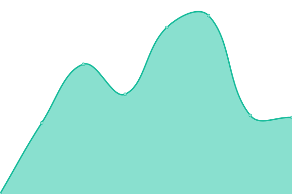
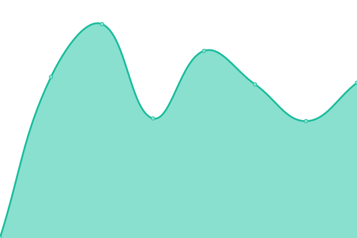

# [📈 Live Status](https://DEDL.github.io/DEDL-uptime): <!--live status--> **🟧 Partial outage**

This repository contains the open-source uptime monitor and status page for [DEDL](https://DEDL.github.io/DEDL-uptime), powered by [Upptime](https://github.com/upptime/upptime).

With [Upptime](https://upptime.js.org), you can get your own unlimited and free uptime monitor and status page, powered entirely by a GitHub repository. We use [Issues](https://github.com/DEDL/DEDL-uptime/issues) as incident reports, [Actions](https://github.com/DEDL/DEDL-uptime/actions) as uptime monitors, and [Pages](https://DEDL.github.io/DEDL-uptime) for the status page.

<!--start: status pages-->
<!-- This summary is generated by Upptime (https://github.com/upptime/upptime) -->
<!-- Do not edit this manually, your changes will be overwritten -->
<!-- prettier-ignore -->
| URL | Status | History | Response Time | Uptime |
| --- | ------ | ------- | ------------- | ------ |
|  [CREODIAS](https://datahub.creodias.eu/odata/v1/Products) | 🟩 Up | [creodias.yml](https://github.com/alecarvennec-csgroup/DEDL-uptime/commits/HEAD/history/creodias.yml) | 

 978ms
     
 | 

<a href="https://alecarvennec-csgroup.github.io/DEDL-uptime/history/creodias">100.00%</a>
    

|  [COP CDS](https://cds.climate.copernicus.eu/api/v2) | 🟥 Down | [cop-cds.yml](https://github.com/alecarvennec-csgroup/DEDL-uptime/commits/HEAD/history/cop-cds.yml) | 

 505ms
     
 | 

<a href="https://alecarvennec-csgroup.github.io/DEDL-uptime/history/cop-cds">100.00%</a>
    

|  [COP Data Space](https://catalogue.dataspace.copernicus.eu/odata/v1/Products) | 🟩 Up | [cop-data-space.yml](https://github.com/alecarvennec-csgroup/DEDL-uptime/commits/HEAD/history/cop-data-space.yml) | 

 1020ms
     
 | 

<a href="https://alecarvennec-csgroup.github.io/DEDL-uptime/history/cop-data-space">100.00%</a>
    

|  [WEkEO](https://wekeo-broker.apps.mercator.dpi.wekeo.eu/databroker/ui) | 🟥 Down | [w-ek-eo.yml](https://github.com/alecarvennec-csgroup/DEDL-uptime/commits/HEAD/history/w-ek-eo.yml) | 

 0ms
     
 | 

<a href="https://alecarvennec-csgroup.github.io/DEDL-uptime/history/w-ek-eo">100.00%</a>
    

|  [DEDL HDA](https://hda.p3.csgroup.space/) | 🟥 Down | [dedl-hda.yml](https://github.com/alecarvennec-csgroup/DEDL-uptime/commits/HEAD/history/dedl-hda.yml) | 

 0ms
     
 | 

<a href="https://alecarvennec-csgroup.github.io/DEDL-uptime/history/dedl-hda">100.00%</a>
    

<!--end: status pages-->

[**Visit our status website →**](https://alecarvennec-csgroup.github.io/DEDL-uptime/)

## 📄 License

- Powered by: [Upptime](https://github.com/upptime/upptime)
- Code: [MIT](./LICENSE) © [DEDL](https://DEDL.github.io/DEDL-uptime)
- Data in the `./history` directory: [Open Database License](https://opendatacommons.org/licenses/odbl/1-0/)
